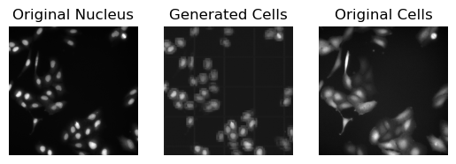
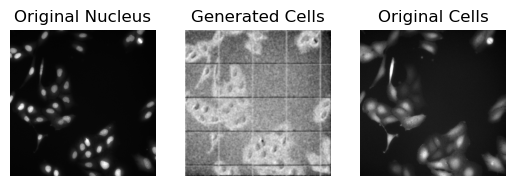

## A generative image project focused on high-content fluorescence microscopy, designed to generate full cell images using only the nuclei channel.




This project focuses on generating the cell channel of a fluorescence microscopy dataset from the nuclei channel to address a batch of missing data. The dataset is shared on Zenodo, with nuclei and cell data described at [nuclei](https://www.sciencedirect.com/science/article/pii/S2352340922009726) and [Cell](https://www.sciencedirect.com/science/article/pii/S2352340924011107).

For this project, several UNet and GAN models were trained with different hyperparameters. To improve UNet performance, we explored advanced loss functions, learning rate schedules, and deeper network architectures. UNets were primarily used for simple image-to-image (I2I) translation tasks.

### UNets

At first try we trained a simple U-shape model which the input is nuclei images and output is cell images
The original data is in 1104x1104 pcs format and the model input is 256x256. 
We needed to extract patches first and feed patches to model
[This](./src/models/UNet.py) is the simplest form of U-Net model for image to image translation
Two UNet models are presented here, along with preprocessing code, model architectures, and training functions. Finally, predictions are visualized by loading the saved models.

### GANs
The Training Process:
Phase 1 - Discriminator Training: Show  the discriminator nuclei images and cell images
Phase 2 - Generator Training: The generator creates new cell images based on discriminator's feedback
Repeat: Both keep improving against each other

```text            
Noise (Random Input)
     ↓
[ GENERATOR ] → Cell images
     ↓
[ DISCRIMINATOR ] → Real/Fake Prediction
     ↓
     ↑
[ REAL IMAGES ] → For Comparison
```

Discriminator Loss
```text
L_D = -[log(P(x)) + log(1 - P(G(z)))]
```


Generator Loss
```text
L_G = -[log(P(G(z)))]
```

